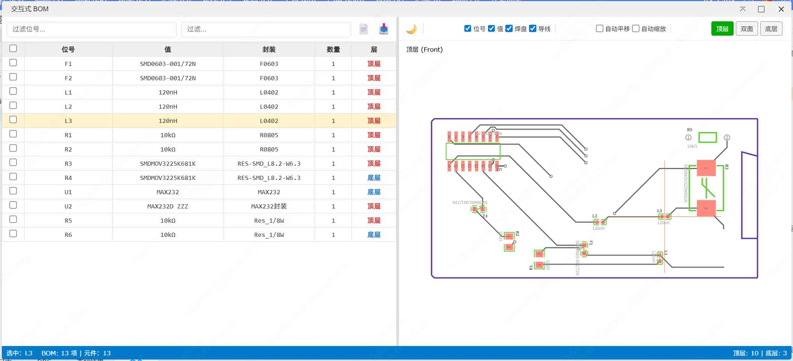

# Interactive BOM

[中文](./README.md)

---

The Interactive BOM Viewer provides real-time PCB preview and BOM linkage functionality for JLCPCB/EasyEDA Pro. This is a reimplementation based on iBOM [InteractiveHtmlBom](https://github.com/openscopeproject/InteractiveHtmlBom). Its features may be fewer than the native iBOM. If you want to use an extension with the same functionality as the native iBOM, please use: [iBOM for EasyEDA](https://github.com/easyeda/eext-interactive-html-bom)



### Features

- ✅ Real-time PCB preview with BOM table interaction
- ✅ Top/Bottom/Both layer view switching
- ✅ Component designator, value, and footprint display
- ✅ Track and via visualization
- ✅ Aggregate/List mode toggle
- ✅ CSV export
- ✅ Dark mode support
- ✅ Multi-language support (Chinese/English)

### Installation

1. Download the latest `.eext` file
2. Open **Advanced > Extensions > Extension Manager** in JLCPCB EDA Pro
3. Click **Install Local Extension** and select the downloaded file

### Usage

1. Open a PCB document
2. Click menu **Advanced > Interactive BOM > Open Interactive BOM**
3. Click rows in the BOM table, and the PCB preview will highlight the corresponding components

### Development

```bash
# Install dependencies
npm install

# Compile
npm run compile

# Build extension
npm run build

# Lint
npm run lint
```

### License

Apache-2.0

### Other

The logo is modified from the icon of [InteractiveHtmlBom](https://github.com/openscopeproject/InteractiveHtmlBom).
